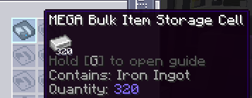

---
navigation:
  title: Célula de Itens em Massa
  icon: bulk_item_cell
  parent: index.md
  position: 040
categories:
  - megacells
item_ids:
  - bulk_item_cell
  - bulk_cell_component
  - compression_card
  - decompression_module
---

# MEGA Cells: Célula de Itens em Massa

Agora passamos para a primeira das células de armazenamento *especializadas* e personalizadas da MEGA. É aqui que as coisas ficam interessantes.

## Célula de Itens em Massa

<Row>
  <ItemImage id="bulk_cell_component" scale="3" />
  <ItemImage id="bulk_item_cell" scale="3" />
</Row>

A **Célula de Itens em Massa da MEGA** é, de muitas maneiras, uma espécie de antítese da
[célula de armazenamento convencional](ae2:items-blocks-machines/storage_cells.md).

Enquanto uma célula padrão é geralmente capaz de armazenar até 63 tipos diferentes de itens, a Célula de Massa só é capaz
de armazenar um único tipo dentro de si. Agora, por si só, isso tornaria a célula bastante inútil, mas a Célula
de Massa tem uma vantagem fundamental para começar: ao contrário da quantidade finita de cada tipo de item em uma célula padrão, uma Célula
de Massa é capaz de armazenar uma quantidade ***infinita*** daquele único tipo de item. E eu quero dizer *infinita*, pelo menos em um
sentido prático. *(veja a seção "Chatice Técnica" um pouco mais abaixo se você for curioso o suficiente)*

Também é importante notar que a Célula de Massa não pode ser criada com nenhuma das estruturas de célula existentes oferecidas pelo AE2 ou pela
MEGA, optando por sua própria estrutura dedicada de Netherite, sempre criada do zero junto com seu componente dedicado.
Por essa razão, a Célula de Massa também não pode ser desmontada de volta em seu componente e estrutura — embora não
houvesse muito sentido em fazer isso de qualquer maneira.

<Row>
  <RecipeFor id="bulk_cell_component" />
  <RecipeFor id="bulk_item_cell" />
</Row>

Uma Célula de Massa recém-criada ainda não pode funcionar; primeiro, ela precisa ser *particionada* (filtrada) para designar qual item ela
armazenará. Isso é feito usando uma <ItemLink id="ae2:cell_workbench" /> ou nossa conveniente
<ItemLink id="portable_cell_workbench" />. Uma vez que isso tenha sido feito, a célula começará a receber o respectivo item,
até mesmo se priorizando como o primeiro e provavelmente o único lugar para onde este item será enviado a partir do momento em que seu filtro
for definido.

Uma vez que a célula tenha começado a receber e armazenar seu respectivo tipo de item, desde que o filtro permaneça o mesmo do
item já contido, ela continuará a funcionar e permitirá tanto a inserção quanto a extração adicionais, assim como uma
célula comum. Se, no entanto, este filtro for acidentalmente limpo ou substituído, a célula apresentará um erro e
se tornará incapaz de aceitar novos itens. Ela permitirá, no entanto, a extração de seu conteúdo existente em caso de
emergência e para fins de recuperação, e uma vez que o filtro original tenha sido recolocado ou a célula tenha sido
esvaziada (recebendo um novo filtro não vazio), ela voltará a funcionar novamente como normal.

### A Chatice Técnica Sobre Capacidade:

Pode-se pensar comumente em uma "capacidade infinita" em qualquer mod de Minecraft como sendo apenas o valor máximo possível
de um determinado tipo de dado numérico, como o limite dentro do Java para um "int" (cerca de 2,14 bilhões), um "long" (cerca de
9,2 *quintilhões*, ou 9,2 * 10^**18**) ou mesmo um "double" (que já atinge *308* ordens de magnitude, embora não
fosse adequado aqui para trabalhar com quantidades de números inteiros).

A Célula de Massa joga todos esses tipos primitivos de lado e, em vez disso, é projetada de forma a conter qualquer
quantidade arbitrariamente grande que um usuário possa razoavelmente conceber. De fato, embora qualquer rede ME só seja
capaz de manipular e exibir até os mencionados 9,2 quintilhões de qualquer tipo de item armazenado nela, a Célula
de Massa é internamente capaz de ir além desse limite e, no mínimo, aludir ao fato de que pode tê-lo
feito.

## Compressão em Massa

<Row>
  <ItemImage id="compression_card" scale="3" />
</Row>

Até agora, cobrimos bem como uma célula de massa funciona como um poço sem fundo para qualquer tipo de item arbitrário.
No entanto, é amplamente compreendido entre a maioria dos jogadores que alguns tipos de itens — ou seja, recursos como *lingotes
de metal* — precisam ser tratados de forma um pouco diferente para fins de armazenamento. Muitas vezes, recursos como lingotes assumem
múltiplas formas para armazenamento e criação, como seus correspondentes maiores de "bloco" para o primeiro, a fim de minimizar
o espaço, e sua forma menor de "pepita" para o último. Embora geralmente seja melhor que estes sejam manuseados junto com seu
respectivo lingote de alguma forma, uma Célula de Massa, em sua forma padrão, não lidaria facilmente com essa expectativa.

É aqui que a mecânica de ***Compressão em Massa*** entra em cena, graças à **Carta de Compressão**, uma
[cartão de melhoria](ae2:items-blocks-machines/upgrade_cards.md) exclusiva da Célula de Massa para este propósito.

<RecipeFor id="compression_card" />

Com a *Compressão* ativada através desta carta, uma Célula de Massa pode ser informada sobre tais formas variantes do recurso sendo
rastreado, a fim de aceitar igualmente essas variantes e automaticamente "comprimi-las" à medida que entram em sua próxima
variante mais alta. Essa compressão automática funciona de acordo com as receitas de criação associadas a essas variantes: se
uma dessas receitas transformasse algo como um (1) lingote de metal em nove (9) pepitas desse metal e outra
receita transformasse essas nove pepitas de volta no lingote original, uma Célula de Massa configurada para armazenar esse metal seria
capaz de aceitar tanto a forma de lingote quanto a de pepita desse metal, transformando cada 9 pepitas inseridas em outro lingote na
hora.

Além disso, essa compressão automática se estende a *todas* as variantes superiores, como blocos de metal e versões ainda mais
"comprimidas" desses blocos fornecidas por tais mods, tudo tratado como uma longa "cadeia" de variantes
da menor para a maior.

Para que essa mecânica funcione, uma Célula de Massa internamente apenas rastreia sua "quantidade" real como a quantidade do
menor item "unitário" possível no qual o recurso pode ser decomposto — tipicamente uma pepita de metal, um fragmento
de gema, um pó ou algum outro equivalente. Ao longo da cadeia mais ampla mencionada anteriormente, uma Célula de Massa com esta mecânica ativada
aceitará felizmente todas essas variantes, tanto superiores quanto inferiores, convertendo-as em uma certa quantidade de "unidades"
onde aplicável, e até mesmo permitirá que qualquer uma delas seja *extraída* através de meios automatizados — como o
<ItemLink id="ae2:import_bus" /> e o <ItemLink id="ae2:export_bus" /> — ou até mesmo um
[terminal](ae2:items-blocks-machines/terminals.md) (ao usar *Shift*+clique para extrair).

No caso em que um mod esteja presente adicionando versões de blocos "comprimidos" muito maiores de um recurso, pode ser desejável
limitar até que ponto um recurso pode ir com a autocompressão para poder rastrear mais facilmente a quantidade desse
recurso em uma forma específica, por exemplo, ao observar o fluxo desse recurso na forma de lingotes. Para este propósito, uma
Célula de Massa com Compressão ativada ainda dentro de uma Bancada de Células permitirá que seu "**limite** de compressão" seja ciclado
através, ditando a variante mais alta que a célula deve ser capaz de acumular em armazenamento e na qual a
autocompressão deve parar. Clicar com o botão esquerdo neste botão cicla o limite para baixo em direção ao item unitário menor, enquanto
clicar com o botão direito cicla para trás em direção a variantes comprimidas cada vez mais altas.

Quando a Compressão está ativada em uma célula, o comportamento de "filtro incompatível" se torna um pouco mais leniente: a célula efetivamente
"lembra" com qual cadeia precisa trabalhar com base no item que já foi configurado para armazenar, e se seu filtro for
acidentalmente removido de alguma forma, ele pode ser substituído por qualquer uma das variantes associadas, em vez da variante específica
usada anteriormente como filtro. Além disso, para fins de correção de erros, no caso de quaisquer receitas de criação
para alguma variante menor que o item configurado na célula serem adicionadas, removidas ou substituídas, o "fator
unitário" atual — ou seja, quantas "unidades" caberão no total em uma instância do item "variante" configurado — também é armazenado
e rastreado, atualizando-se de acordo quando a cadeia geral para essas variantes sofre tal mudança.

Como último recurso, se em algum cenário de pior caso uma célula de massa estiver totalmente inutilizada, independentemente do filtro (re)aplicado a
ela, e entrar no modo de "recuperação" mencionado anteriormente, quaisquer variantes menores poderão ser recuperadas junto com o
item base para o qual a célula foi inicialmente particionada.

## Módulo de Descompressão

<GameScene zoom="8" background="transparent">
  <ImportStructure src="assets/assemblies/decompression_module.snbt" />
  <IsometricCamera yaw="195" pitch="10" />
</GameScene>

Até aqui, tudo bem. Sabemos que com a Compressão ativada, uma Célula de Massa pode facilmente trabalhar com quaisquer variantes correspondentes quando
inseridas ou extraídas por um jogador ou por dispositivos como o <ItemLink id="ae2:import_bus" /> e
<ItemLink id="ae2:export_bus" />. Agora, e quanto à criação automática?

Este é um pouco mais complicado. No AE2, o sistema de [criação automática](ae2:ae2-mechanics/autocrafting.md) baseia-se na
suposição de que "o que você vê é o que você obtém". Se o sistema de armazenamento relatar apenas, por exemplo, 5 lingotes de ferro, então o
sistema de criação assumirá que, sem um [molde](ae2:ae2-mechanics/autocrafting.md#patterns) para dizer como
fazer mais lingotes de ferro, ele terá apenas esses 5 para trabalhar em uma determinada tarefa de criação e será incapaz de realizá-la
se mais lingotes forem necessários. O problema surge, então, quando a Compressão está configurada para uma Célula de Massa que armazena
lingotes de ferro, o sistema de armazenamento pode nunca relatar mais do que (tipicamente) 8 lingotes a qualquer momento se
a célula estiver configurada para um limite mais alto, deixando o sistema de criação incapaz de trabalhar com qualquer tarefa que possa eventualmente exigir
mais lingotes de ferro para cumprir uma etapa anterior.

A solução para este problema vem na forma do **Módulo de Descompressão da MEGA**, uma peça de cabo relativamente simples que
serve quase como uma extensão para o sistema de criação automática e instalações de uma rede regular.

<RecipeFor id="decompression_module" />

Quando um Módulo de Descompressão é colocado em qualquer lugar da rede, ele varrerá continuamente a rede em busca de quaisquer Células
de Massa com Compressão ativada conectadas e gerará automaticamente um conjunto de "moldes falsos" especializados para cada célula que
encontrar, cobrindo cada item na cadeia de variantes correspondente àquela célula. Esses moldes são então manuseados completamente
internamente, sem a necessidade de configurações dedicadas com <ItemLink id="ae2:pattern_provider" /> ou
<ItemLink id="ae2:molecular_assembler" />, permitindo que o sistema de criação continue operando normalmente ao
"criar" mais de um item que tecnicamente já está sendo armazenado.

Esses moldes respondem de acordo com o limite definido em uma Célula de Massa individual; moldes gerados para variantes menores
que o item de limite pegam sua variante superior anterior para serem criados *para baixo* em várias dessas variantes menores,
enquanto moldes gerados para variantes maiores pegam várias da variante menor anterior para serem criados para cima. Qualquer
que seja a direção tomada por esses moldes, no entanto, cada variante em ambos os lados do ponto de corte ainda é automaticamente
contabilizada caso uma tarefa de criação maior as exija.

O módulo também permite que uma [prioridade](ae2:ae2-mechanics/autocrafting.md#priority) "global" seja definida para todos esses
moldes juntos, em relação a qualquer infraestrutura de criação regular, como Provedores de Moldes com seus próprios moldes para
um determinado item variante, clicando com o botão direito no módulo para abrir o menu de prioridade.

O Módulo de Descompressão é um dispositivo do tipo "configure e esqueça", e você normalmente só precisa de um módulo em uma determinada
rede para que toda a sua funcionalidade de criação automática seja ativada. ***TENHA EM MENTE, NO ENTANTO***, que o módulo funciona apenas
na mesma rede e só pode rastrear células conectadas a Baús ME e Drives na mesma
rede principal que ele. Ele ***NÃO FUNCIONARÁ*** através de [sub-redes](ae2:ae2-mechanics/subnetworks.md), por exemplo, então você
deve garantir que seu armazenamento em Massa permaneça centralizado dentro de sua rede principal para que o módulo o reconheça
completamente.