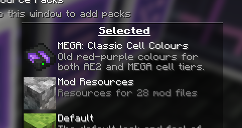
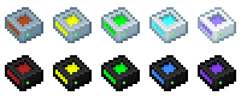
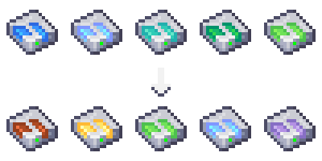
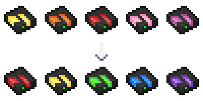

---
navigation:
  title: Extras
  icon: mega_interface
  parent: index.md
  position: 060
categories:
  - megacells
item_ids:
  - mega_interface
  - cell_dock
  - portable_cell_workbench
---

# MEGA Cells: Extras

Com a premissa principal do add-on abordada, agora concluímos com alguns dos recursos e adições extras menores
fornecidos pela MEGA, tanto para fins de completude quanto para um pouco mais de experimentação.

## Interface MEGA

<Row>
  <BlockImage id="mega_interface" scale="4" />
  <GameScene zoom="4" background="transparent">
    <ImportStructure src="assets/assemblies/cable_mega_interface.snbt" />
  </GameScene>
</Row>

Como um complemento para o <ItemLink id="megacells:mega_pattern_provider" />, a **Interface MEGA** serve como uma
versão de capacidade dupla da <ItemLink id="ae2:interface" />. O dobro de slots, o dobro de I/O e de taxa de transferência, e o dobro
de manutenção de estoque.

<RecipeFor id="mega_interface" />
<RecipeFor id="cable_mega_interface" />

## Bancada de Células Portátil

<ItemImage id="portable_cell_workbench" scale="4" />

Um tanto fora do personagem para o resto do add-on, a **Bancada de Células Portátil** é uma... versão *menor* da
<ItemLink id="ae2:cell_workbench" />. Pequena o suficiente, na verdade, para caber na palma da sua mão, enquanto ainda
é capaz de configurar qualquer célula de armazenamento normalmente.

Resta imaginar como uma bancada de trabalho inteira pôde caber nesta coisa.

<RecipeFor id="portable_cell_workbench" />

## Doca de Células

<GameScene zoom="8" background="transparent">
  <ImportStructure src="assets/assemblies/cell_dock.snbt" />
  <IsometricCamera yaw="195" pitch="30" />
</GameScene>

Finalmente, temos algo que é, mais uma vez, menor em vez de maior, e é por isso que parecia mais deslocado
do que qualquer outra coisa chamá-lo de item "MEGA".

A **Doca de Células ME** é, de certa forma, como uma versão mais compacta do <ItemLink id="ae2:chest" />, capaz de armazenar
dentro de si uma célula de armazenamento por vez. Embora possa não ter algumas das funcionalidades extras do Baú — a saber, seu
terminal embutido — ela ainda é um bom provedor de armazenamento compacto. Em particular, como vem na forma de uma
[peça de cabo](ae2:ae2-mechanics/cable-subparts.md) "plana", um único cabo pode conter várias Docas de Células no mesmo
espaço de um bloco. Talvez alguém a ache útil no caso de uma sub-rede compacta que requeira algum tipo de
armazenamento de buffer temporário.

<RecipeFor id="cell_dock" />

## "Cores Clássicas das Células"

Como uma referência visual opcional, a MEGA fornece o seguinte pacote de recursos que o usuário pode optar por ativar.

Em lançamentos tanto do AE2 quanto de seus add-ons anteriores ao Minecraft 1.21, as texturas antigas para quaisquer conjuntos de células de armazenamento seguiam
um esquema de cores de 5 pontos, começando com um marrom avermelhado para as células de 1k e mudando através do amarelo, verde e azul em direção
a um tom final de violeta claro/lavanda para as de 256k. A MEGA também seguiu essa tendência com seus próprios tiers de células, começando com um vermelho
escuro em 1M e terminando com um violeta mais profundo em 256M.

Com a reformulação mais ampla de texturas introduzida no AE2 após a versão 1.20.x, as células de armazenamento também foram adaptadas para seguir uma
paleta de cores um pouco mais ampla, com as células de armazenamento base do AE2 seguindo uma mudança de tom de azul para verde ao longo de sua progressão de tier e
a MEGA pretendendo continuar a progressão do amarelo para o vermelho e para o rosa. Embora isso também seja muito bom, não pareceu
uma má ideia incluir também a opção do sistema de cores antigo para aqueles que talvez o prefiram em vez do
atual.

