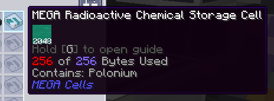

---
navigation:
  title: Célula de Químico Radioativo (exclusivo AppMek)
  icon: radioactive_chemical_cell
  parent: index.md
  position: 050
categories:
  - megacells
item_ids:
  - radioactive_cell_component
  - radioactive_chemical_cell
---

# MEGA Cells: Célula de Químico Radioativo

Como parte de sua ampla integração entre add-ons, o MEGA apresenta uma segunda célula especializada, exclusiva para jogadores que também usam
o *Mekanism* e o add-on ***Applied Mekanistics***. Se você não estiver usando nenhum deles e as receitas abaixo estiverem
com erro, pode ignorar esta página com segurança e fingir que esta célula não existe.

## Célula de Químico Radioativo

<Row>
  <ItemImage id="radioactive_cell_component" scale="3" />
  <ItemImage id="radioactive_chemical_cell" scale="3" />
</Row>

A **Célula de Químico Radioativo MEGA**, como o nome indica, serve como um complemento para as células de armazenamento comuns
oferecidas pelo *Applied Mekanistics* (e a própria integração do MEGA com ele) para armazenar os "químicos" do *Mekanism*. Normalmente,
ao usar as células de químicos comuns, pode-se notar que elas vêm com uma ressalva: não armazenam nenhum
químico que seja *radioativo*, o que no Mekanism inclui principalmente *Lixo Nuclear*, *Polônio* e *Plutônio*.
A Célula Radioativa, claro, armazena apenas os químicos mencionados.

<Row>
  <RecipeFor id="radioactive_cell_component" />
  <RecipeFor id="radioactive_chemical_cell" />
</Row>

A Célula Radioativa não é tão diferente da <ItemLink id="megacells:bulk_item_cell" />, pois só pode armazenar
um único tipo de composto radioativo e precisa ser particionada antes de operar. É aqui que as semelhanças terminam
entre as duas, no entanto; a Célula Radioativa armazena apenas uma quantidade finita desse químico, com um máximo de *256
[bytes](ae2:ae2-mechanics/bytes-and-types.md)*. Isso, no entanto, é o equivalente a *2048 baldes* — ou o conteúdo de 4 Barris de Lixo Nuclear — no espaço de uma única célula.

Para conter e armazenar substâncias tão voláteis, a célula exige uma quantidade consideravelmente maior de energia para (de alguma forma!)
mantê-las em um estado relativamente estável. Em comparação com o consumo de energia típico de 0.5 AE/tick para a
<ItemLink id="ae2:item_storage_cell_1k" />, 2.5 AE/t para a <ItemLink id="ae2:item_storage_cell_256k" /> e 5 AE/t
para a <ItemLink id="megacells:item_storage_cell_256m" />, uma única Célula Radioativa consome impressionantes **250 AE/tick** enquanto
estiver dentro de um Baú/Drive ME conectado.

Por fim, para incentivar os jogadores de Mekanism a continuar gerenciando adequadamente seu lixo nuclear como planejado, a Célula
Radioativa ainda proíbe explicitamente o armazenamento de ***Lixo** Nuclear **Gasto***. *Por padrão*, você não vai
se livrar tão facilmente da responsabilidade de manter suas estações de reator nuclear sob controle. Para os jogadores que ainda assim querem seguir o
caminho mais fácil, no entanto, este comportamento é configurável. *Como* este comportamento é configurado fica como um exercício para o
leitor.