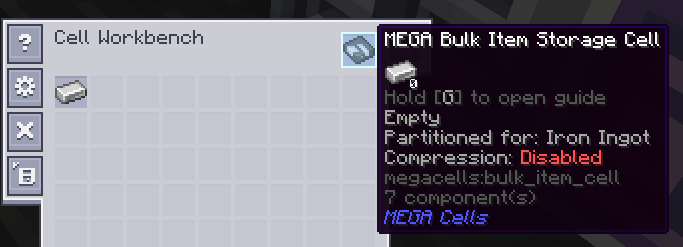

---
navigation:
  title: Bulk Item Cell
  icon: bulk_item_cell
  parent: index.md
  position: 040
categories:
  - megacells
item_ids:
  - bulk_item_cell
  - bulk_cell_component
  - compression_card
---

# MEGA Cells: Bulk Item Cell

We now move onto the first of MEGA's bespoke *specialised* storage cells. This is where things get interesting.

## Bulk Item Cell

<Row>
  <ItemImage id="bulk_cell_component" scale="3" />
  <ItemImage id="bulk_item_cell" scale="3" />
</Row>

The **MEGA Bulk Item Cell** is, in many ways, a sort of antithesis to the
[conventional storage cell](ae2:items-blocks-machines/storage_cells.md).

While a standard cell is generally capable of holding up to 63 different types of items, the Bulk Cell is only capable
of storing a single type within itself. Now, in and of itself, this would make the cell rather pointless, but the Bulk
Cell does have one key advantage to start with: unlike the finite quantity of each item type on a standard cell, a Bulk
Cell is able to store an ***infinite*** amount of that single item type. And I do mean *infinite*, at least in a
practical sense. *(see the "Technical Bore" section a bit lower down if you're curious enough)*

<Row>
  <RecipeFor id="bulk_cell_component" />
  <RecipeFor id="bulk_item_cell" />
</Row>

In order for a Bulk Cell to function once you have made it, the cell needs to know in advance what item it should be
trying to store and handle, so it will not accept any items until this item has been configured. For the cell to begin
working, it needs to be *partitioned* (filtered) to the item in question using a <ItemLink id="ae2:cell_workbench" />.
Once this has been done, the cell will begin to take in that respective item, even prioritising itself as the first and
probably only place that this item will be sent to from the moment its filter is set.

Once the cell has started to take in and store its respective item type, as long as the filter remains the same as the
item now already contained, it will continue to function and allow both further insertion and extraction just as a
regular cell would. Should this filter be accidentally either cleared or replaced, however, the cell will error out and
become unable to accept any new items. It will, however, allow for the extraction of its existing contents in case of
emergency and for the sake of recovery, and once either the original filter has been replaced or the cell has been
emptied (given a new non-empty filter), it will continue to function again as normal.

### The Technical Bore About Capacity:

One might commonly think of an "infinite capacity" in any given Minecraft mod as just being the maximum possible value
of a given type of numerical data, such as the limit within Java for an "int" (around 2.14 billion), a "long" (around
9.2 *quintillion*, or 9.2 \* 10^**18**) or even a "double" (which already reaches *308* orders of magnitude, though it
wouldn't be suitable here at all for working with whole-number quantities).

The Bulk Cell casts all of these primitive types by the wayside, and is instead designed in such a way to hold any
arbitrarily large quantity a user could reasonably conceive. Indeed, even though any given ME network will only ever be
able to handle and display up to the aforementioned 9.2 quintillion of any given item type stored within it, the Bulk
Cell is perfectly capable internally of going beyond this limit, and at the very least alluding to the fact that it may
have done so.

## Bulk Compression

<Row>
  <ItemImage id="compression_card" scale="3" />
</Row>

(TODO: Compression Card and overall mechanic)

<RecipeFor id="compression_card" />

### Decompression Module

(TODO: Decompression Module)

<RecipeFor id="decompression_module" />
